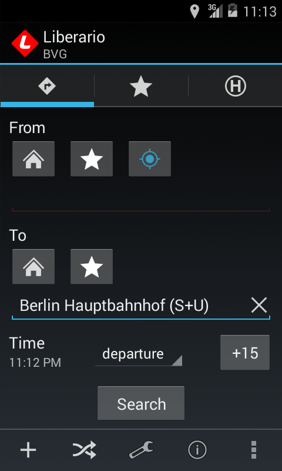
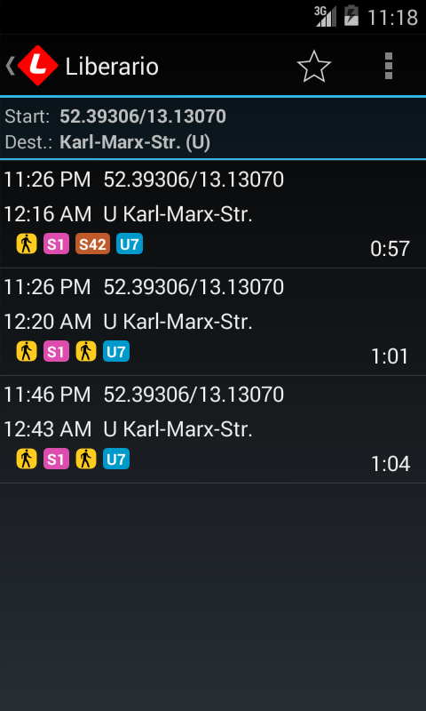
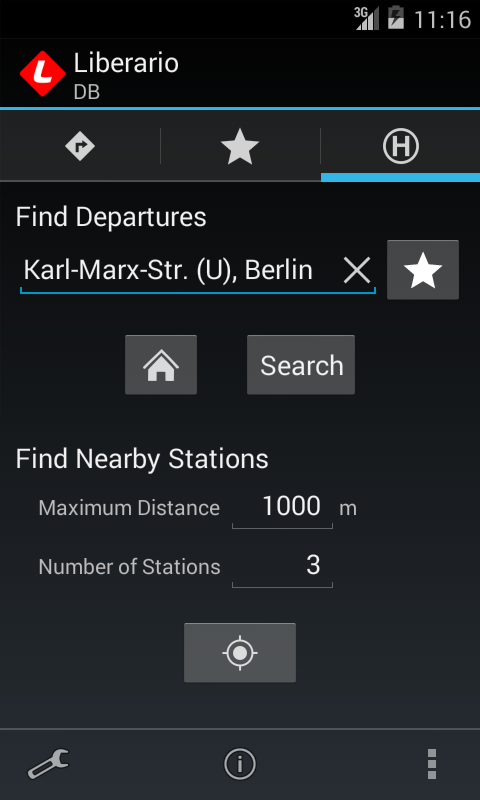
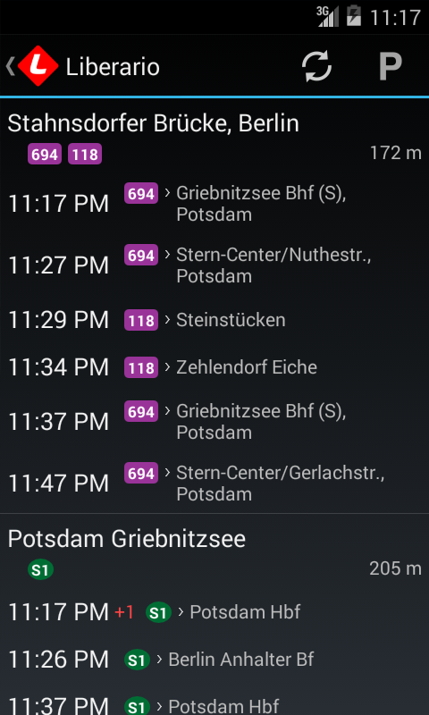

Liberario
=========

A Free Software public transport app for Android which you can freely use, study, share and improve. It's name comes from *libertad* and *horario* which means *freedom* and *timetable*.

**Attention:** There is no guarantee for the correctness of the data. Please only use this app at your own risk.

Contributions are both encouraged and appreciated. If you like to contribute please [see below](#contributing) for more information.

If you find any issues with this app, please report them at [the issue tracker](https://github.com/grote/Liberario/issues).

Get Liberario
-------------

Screenshots
-----------

Coverage
--------

In order to access public transport data, Liberario is using the [public transport enabler](http://code.google.com/p/public-transport-enabler/) library. So it supports all areas that this library also supports.

### Continents and Countries ###

* Europe (mostly long-distance)
* Germany (long-distance, regional and local, e.g. Berlin, Hamburg, Munich, Cologne, Frankfurt, Stuttgart)
* Austria (long-distance, regional and local, e.g. Vienna, Graz, Linz, Salzburg, Innsbruck)
* Belgium (long-distance, regional and local, e.g. Antwerp, Ghent, Charleroi, Brussels)
* Luxembourg (long-distance, regional and local)
* Denmark (long-distance, regional and local, e.g. Copenhagen)
* Sweden (long-distance, regional and local, e.g. Stockholm)
* Norwegen (long-distance, regional and local, e.g. Oslo, Bergen)
* Poland (long-distance, regional and local, e.g. Warsaw)
* U.K. (long-distance, regional and local, e.g. London)
* Ireland (long-distance, regional and local, e.g. Dublin)

### Local and Regional ###

* Berlin & Brandenburg (local and regional)
* Frankfurt/Rhine-Main, Kassel & Hesse (local and regional)
* Munich (local and regional)
* North Rhine-Westphalia (Cologne, Dortmund, Düsseldorf, Münster, ...) (local and regional)
* Lüdenscheid & Märkischer Kreis (local and regional)
* Paderborn & Höxter (local and regional)
* Mannheim, Rhine-Neckar & Rhein-Nahe (local and regional)
* Stuttgart (local and regional)
* Neckar-Alb-Donau (Reutlingen, Tübingen, ...) (local and regional)
* Ulm (local and regional)
* Karlsruhe (local and regional)
* Trier (local and regional)
* Würzburg & Regensburg (local and regional)
* Strasbourg & Freiburg (local and regional)
* Baden-Württemberg, Constance & Basel (local and regional)
* Kiel, Lübeck & Schleswig-Holstein (local and regional)
* Hannover & Lower Saxony (local and regional)
* Bremen, Bremerhaven & Oldenburg (local and regional)
* Schwerin & Mecklenburg-Vorpommern (local and regional)
* Leipzig, Halle & Saxony-Anhalt (local and regional)
* Plauen & Vogtland (local and regional)
* Vienna (local and regional)
* Linz (bus, tram and cablecar)
* Graz & Styria (local and regional)
* Tyrol (local and regional)
* London (local and regional)
* Birmingham (local and regional)
* Dublin (local and regional)
* Maribor (local and regional)
* Philadelphia (local and regional)
* Sydney (local and regional)
* Melbourne (local and regional)

Contributing
------------

There is a lot to do to make this app better and more complete. So contributions are both encouraged and appreciated. If you want to do more than fixing bugs, please talk to me *before* doing any major work so that we can coordinate, prevent duplicated work and discuss the best approach for your undertaking.

Missing features are documented in the [issue tracker](https://github.com/grote/Liberario/issues?labels=enhancement&state=open). Feel free to look there for ideas or to add your own.

### Translate Liberario Into Your Language ###

Translating Liberario is very easy. Just sign up for an account at [Transifex](https://www.transifex.com). After you are logged in, go to the [Liberario translation project](https://www.transifex.com/projects/p/liberario/). There you can click the "Request language" button if your language does not exist, or if you want to improve existing translations, apply for the respective language team.

What you translate there will then be included in the next release of Liberario.

### Building From Source ###

If you want to start working on Liberario and if you haven't done already, you should [familiarize yourself with Android development](https://developer.android.com/training/basics/firstapp/index.html) and [set up a development environment](https://developer.android.com/sdk/index.html).

The next step is to clone the source code repository. Please make sure to also clone the git submodules that contain external libraries.

    $ git submodule init
    $ git submodule update

Then, you also need to run the following command to build the public transport enabler library.

    $ ./build-pte.sh

If you don't want to use an IDE like Eclipse, you can build Libeario on the command line as follows.

    $ ${ANDROID_HOME}/tools/android update project -p sublibs/Android-PullToRefresh/library/
    $ ${ANDROID_HOME}/tools/android update project -p sublibs/ckChangeLog/library/
    $ ${ANDROID_HOME}/tools/android update project --name Liberario -p .
    $ ant release

The resulting unsigned apk file will be found at `bin/Liberario-release-unsigned.apk`.

### Adding Support For A New Area ###

Ideally, Liberario will cover the whole world some day. To achieve this, we need more people adding support for other public transport networks. However, this is out of the scope of this app. It uses the [public transport enabler](http://code.google.com/p/public-transport-enabler/) library. This is the place where to add new transport networks. This way not only Liberario will benefit from your work, but also other apps using this library.

License
-------

This program is Free Software: You can use, study share and improve it at your
will. Specifically you can redistribute and/or modify it under the terms of the
[GNU General Public License](https://www.gnu.org/licenses/gpl.html) as
published by the Free Software Foundation, either version 3 of the License, or
(at your option) any later version.
