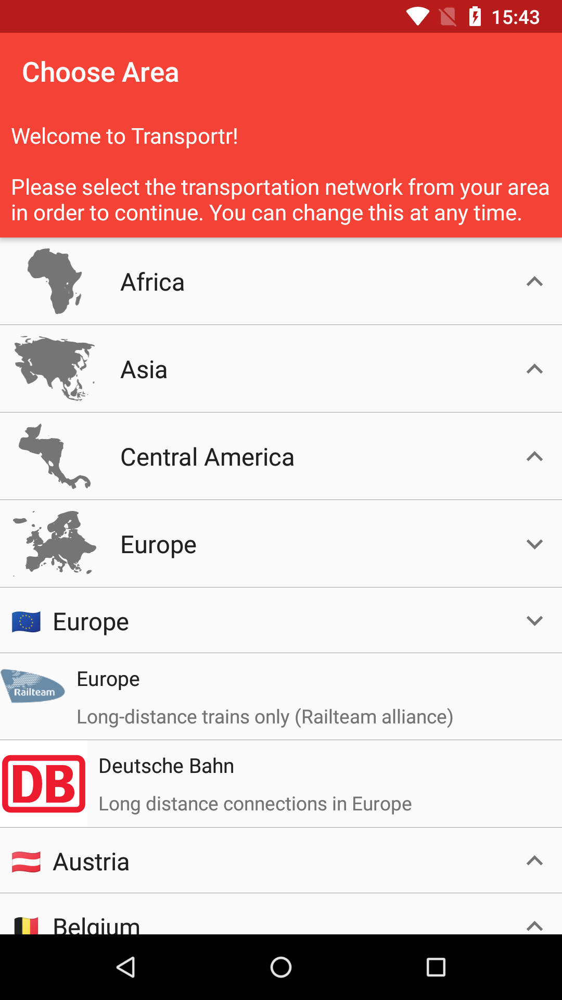
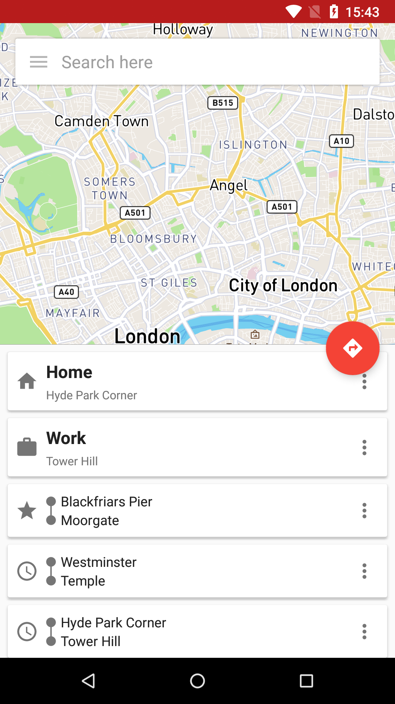
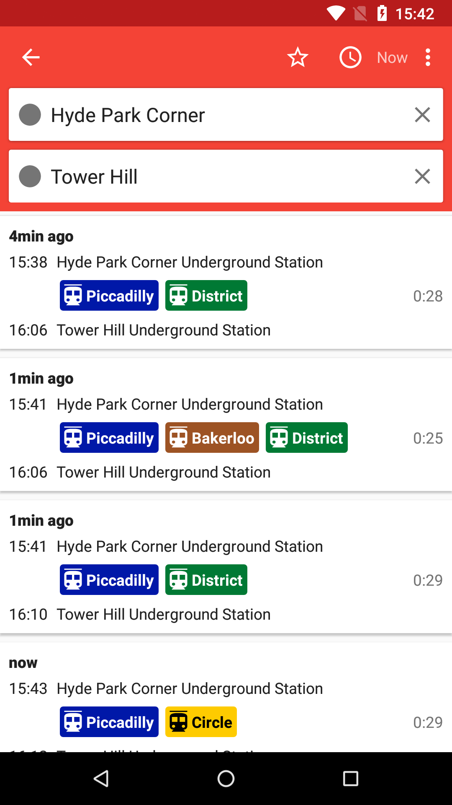
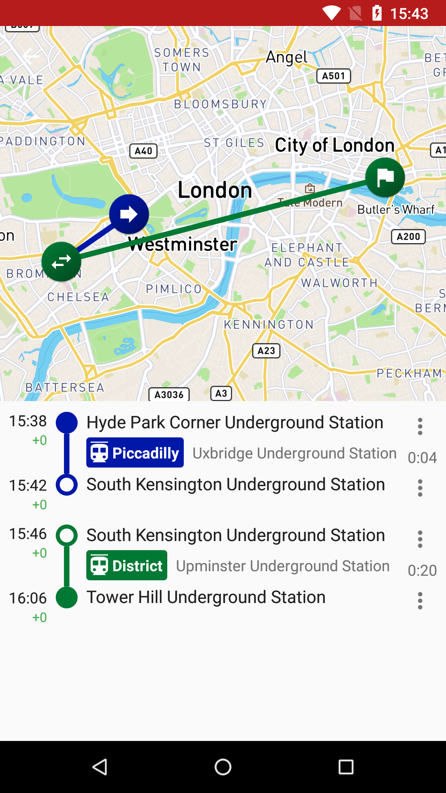
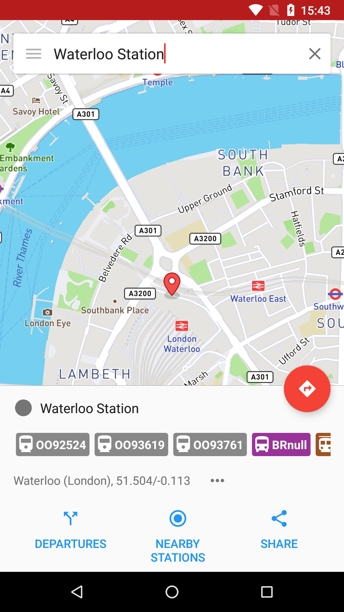
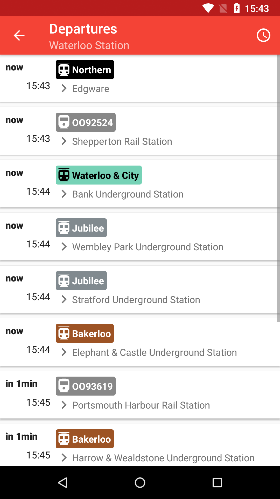

Transportr
==========

The public transport companion that respects your privacy and your freedom.
Transportr is a non-profit app developed by people around the world to make using public transport as easy as possible wherever you are. 

Please **[visit the website](https://transportr.app)** for more information!

If you find any issues with this app, please report them at [the issue tracker](https://github.com/grote/Transportr/issues). Contributions are both encouraged and appreciated. If you like to contribute please [check the website](https://transportr.app/contribute) for more information.

The upstream repository is at: https://github.com/grote/Transportr

Get Transportr
--------------

Pre-releases and beta versions for advanced users are available via [a special F-Droid repository](http://grobox.de/fdroid/).

Screenshots
-----------

Building From Source
--------------------

If you want to start working on Transportr and if you haven't done already, you should [familiarize yourself with Android development](https://developer.android.com/training/basics/firstapp/index.html) and [set up a development environment](https://developer.android.com/sdk/index.html).

The next step is to clone the source code repository.

    $ git clone https://github.com/grote/Transportr.git

If you don't want to use an IDE like Android Studio, you can build Transportr on the command line as follows.

    $ cd Transportr
    $ gradle assembleRelease

License
-------

This program is Free Software: You can use, study share and improve it at your
will. Specifically you can redistribute and/or modify it under the terms of the
[GNU General Public License](https://www.gnu.org/licenses/gpl.html) as
published by the Free Software Foundation, either version 3 of the License, or
(at your option) any later version.
